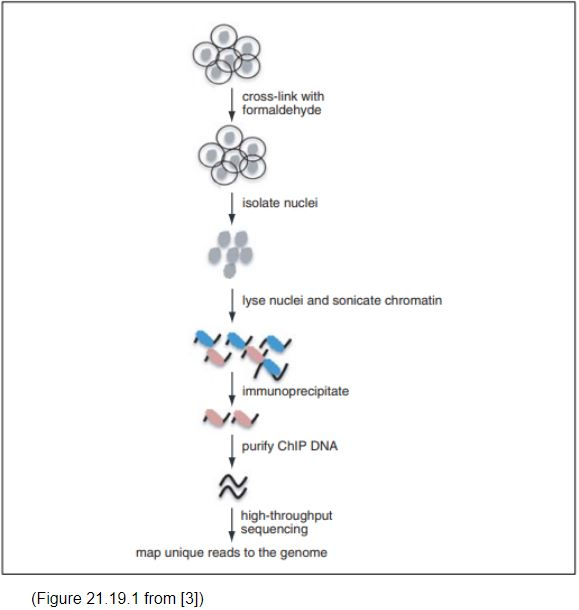
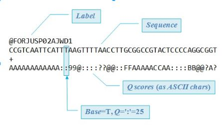
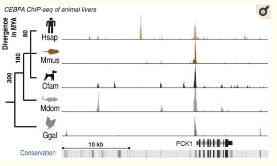
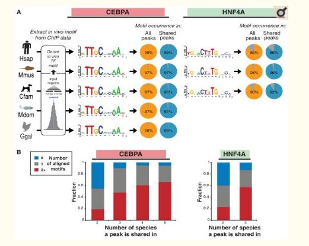

# ChIP-Seq

1. [Introduction](#intro)
2. [Methods](#methods)
3. [Analysis Pipeline](#analysis)
4. [References](#ref)

## Introduction 

### What is ChIP-Seq?
**Ch**romatin **I**mmuno**p**recipitation **Seq**uencing is a procedure that is used to determine the binding sites of targeted DNA transciption factors using immunoprecipitation and high throughput sequencing.

#### What is is used for?
Identifying genome-wide DNA binding sites for transcription factors. Allows for easy identification of binding sites of a specific protein target. This requires a protein specific antigen for immunoprecipitation of target the target protein.

#### What are the advantages over existing technology?

This technology was developed as a better alternative to Chip  captures DNA targets for transcription factors or histone modifications across the entire genome and defines transcription factor binding sites.

## Methods

In order to conduct ChIP-seq it is necissary to first identify the target transcription factor or histone modification you want to study. Once the protein is identified, an antigen specific to the  protein needs to be designed for the immunoprecipitation step. This is crucial for isolating DNA attached to the protein since the antigen is able to bind to the protein and is then easily isolated. 

#### Protocol Overview: 
1. ChIP-Sequencing is initialized with the crosslinking of proteins to the DNA using formaldehyde.
2. The nuclei are isolated and lysed then the chromatin is sonicated for fragmentation.
3. Target DNA is isolated during the  immunoprecipitate step. 
Antibodies specific to target protein are attached and used to isolate sections of DNA that the protein is bound to.
4. ChIP DNA is purified by reversing the crosslinking of proteins and the DNA is prepped for high-throughput sequencing.

A full lab protocol for ChIP-seq can be found here: https://currentprotocols.onlinelibrary.wiley.com/doi/full/10.1002/0471142727.mb2119s91 [3]

## Analysis

1. Match output file to reference genome
   - Individual reads from sequencing are presented in FASTQ format
   - The FASTQ files are then matched with the reference genome file
   
   FASTQ Format:
   
   
   
2. Determine significance of reads locations based on quantity and uniqueness of each read.

   Highly significant locations will have high quantities of reads. These locations are known as "peaks". Before we can confirm the significance of an identifies peak we need to establish a peak threshold and normalize the data.
   
   Normalization:
   - Eliminate low quality reads
   - Account for duplicate reads
   - Account for background noise
     -Noise: Random fragments that made it through to sequencing)
   
   From [Practical Guidelines for the Comprehensive Analysis of ChIP-seq Data](#prac)
   > A pivotal analysis for ChIP-seq is to predict the regions of the genome where the ChIPed protein is bound by finding regions with significant numbers of mapped reads (peaks). A fine balance between sensitivity and specificity depends on choosing an appropriate peak-calling algorithm and normalization method [1]

3. Data Visualization
   - Good data visualization is vital for making inferences and interpreting data
   - Best way this is done is to use a genome browser
     - There are many genome browsers out there some of the more popular ones include UCSC genome browser and GIVE. 
   - GIVE allows easy lookup and code generation for ChIP-Seq data
      - Using the code template you are able to manipulate your data in a way that suits your needs. More information about give can be found [here](#here)
      
  
   #### Example: 
   
   
   
   This is a figure shows the comparison of ChIP-seq data using the UCSC genome browser. You can see the differences in the transcription factor binding sights quite easily by comparing the peaks accross each data track. 
  
4. Interpreting Data
   - Identify potential binding motif of transcription factor
     - Motif: Common binding sequence
     - Importance of each nucleotide is denoted by the size of each letter
    - Make additional inferences about target protein
      - Identify functions of transcription factor
      - Identify changes in transcription factor binding across different species or cell types. 
      
     
   Example:
   A study conducted at the Cabridge Research Institute in 2010 by Dominic Schmidt looked at the evolutionary dynamics of transciption factor binding sites accross multiple different species. 
  
  
   (Figure 1 from [4])
  
   This first image shows
   >CEBPA binding in vivo in livers isolated from five vertebrate species cross-mapped to the human PCK1 gene locus. A rare ultraconserved binding event is shown surrounded by species-specific and partially-shared binding events. 
  
   The bottom bar in the image shows the 
   > evolutionary conservation measured across 44 vertebrate species, and darker shading represents slower evolution.
  
   From the figure we can see high amount of evolutionary divergence displayed by this transcription factor. They were able to show that a very small amount of binding sites were conserved between the species that they studied.  After identifying this relationship, these researchers attempted to determine the cause of the evolutionary divergence. 
   
   
   
   (Figure 1 from [4])

   This second image shows the binding motifs of two different transcription factors that were tested across multiple different species. It is easy to tell that the binding motif of the transcription factors did not change much between species. This shows that the evolutionary divergence was due to changes in the DNA sequence or configuration itself resulting in the differential binding sites seen across. 

## References

[1] Bailey, Timothy et al. “Practical guidelines for the comprehensive analysis of ChIP-seq data” PLoS computational biology vol. 9,11 (2013): e1003326. <a name = "prac"><a/>
 
Link: https://www.ncbi.nlm.nih.gov/pmc/articles/PMC3828144
 
[2] “Chromatin Immunoprecipitation Sequencing (ChIP-Seq).” Sequencing Technology | Sequencing by Synthesis, Illumina, www.illumina.com/techniques/sequencing/dna-sequencing/chip-seq.html.
 
Link: www.illumina.com/techniques/sequencing/dna-sequencing/chip-seq.html
 
[3] Raha, Debasish, et al. “ChIP-Seq: A Method for Global Identification of Regulatory Elements in the Genome.” Current Protocols in Molecular Biology, vol. 91, no. 1, 15 July 2010, doi:10.1002/0471142727.mb2119s91.
 
Link: https://currentprotocols.onlinelibrary.wiley.com/doi/full/10.1002/0471142727.mb2119s91
 
[4] Schmidt, Dominic et al. “Five-vertebrate ChIP-seq reveals the evolutionary dynamics of transcription factor binding” Science (New York, N.Y.) vol. 328,5981 (2010): 1036-40.

Link: https://www.ncbi.nlm.nih.gov/pubmed/20378774
 
[5] Zhong. “ChIP Sequencing” Lecture, 16 October 2018.
 
Link: https://docs.google.com/presentation/d/1Va34FmS3-DqZXPqmbybBgL1qgNaUwcGcm86wXHkKrlI/edit#slide=id.p16

[6] Zhong. "Data Visualization,GIVE" Lecture, 11 November 2018.

Link: https://drive.google.com/file/d/0B8j1ae_cKhUfeHEzS3ZCTkVfSGN1b2FTZGtldHZnY0h3Snhz/view?usp=sharing<a name = "here"><a/>
